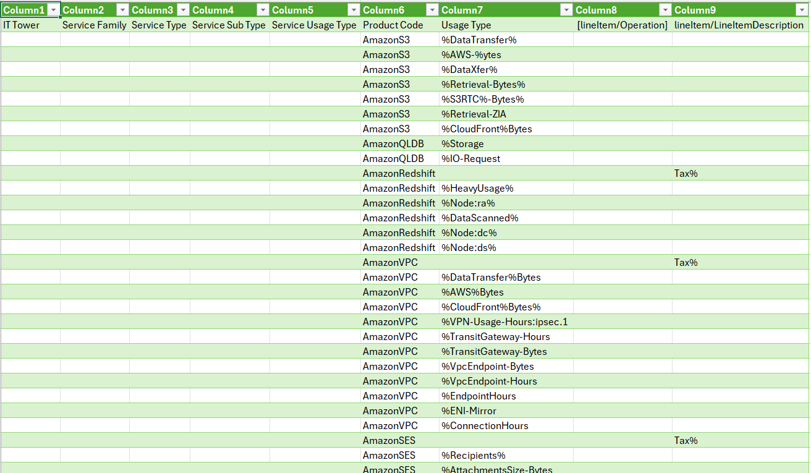
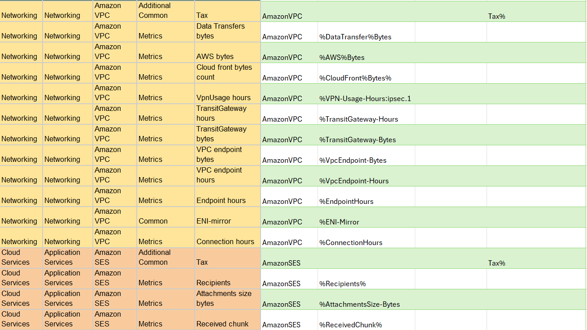

# Лабораторная работа 1. Знакомство с IaaS, PaaS, SaaS сервисами в облаке на примере Amazon Web Services (AWS). Создание сервисной модели.
# Вариант 10

## Цель работы:
Знакомство с облачными сервисами. Понимание уровней абстракции над инфраструктурой в облаке. Формирование понимания типов потребления сервисов в сервисной-модели.

## Дано:
Слепок данных биллинга от провайдера после небольшой обработки в виде SQL-параметров. Символ % в начале/конце означает, что перед/после него может стоять любой набор символов.
Образец итогового соответствия, что желательно получить в конце. В этом же документе

## Необходимо:
1. Импортировать файл .csv в Excel или любую другую программу работы с таблицами. Для Excel делается на вкладке Данные – Из текстового / csv файла – выбрать файл, разделитель – точка с запятой.
2. Распределить потребление сервисов по иерархии, чтобы можно было провести анализ от большего к меньшему (напр. От всех вычислительных ресурсов Compute дойти до конкретного типа использования - Выделенной стойка в датацентре Dedicated host usage).
3. Сохранить файл и залить в соответствующую папку на Google Drive.

## Алгоритм работы:
Сопоставить входящие данные c документацией. Написать в соответствие колонкам справа значения колонок слева, которые бы однозначно классифицировали тип сервиса. Для столбцов IT Tower и Service Family значения можно выбрать из образца.

## Выполнение работы

1. Импортировали в Excel данные из csv:

## Сервисы

1. **Amazon Simple Email Service (Amazon SES)** - электронная почта.
2. **Amazon Simple Notification Service (Amazon SNS)** - сервис для sms, email и push-уведомлений.
3. **Amazon Redshift** - очень большая и надежная СУБД петабайтного масштаба.
4. **Amazon Quantum Ledger Database (Amazon QLDB)** - БД, хранящая историю всех изменений определенных объектов.
5. **AmazonS3** - это хранилище объектов. Amazon S3 используется для хранения и извлечения любого объема данных (видео, фото и т.д.).
6. **Amazon Virtual Private Cloud (Amazon VPC)** - сервис для выделения локальных сетей в облаке.

## Результатs

## Использованные источники
1. Официальная документация Amazon Web Services: https://docs.aws.amazon.com
