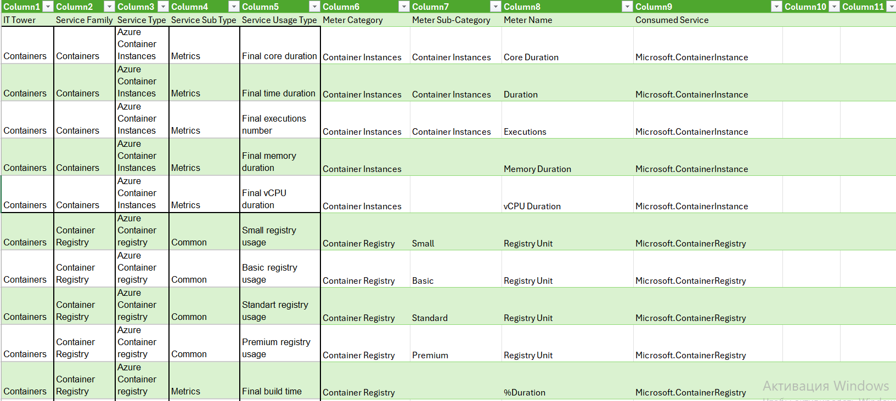
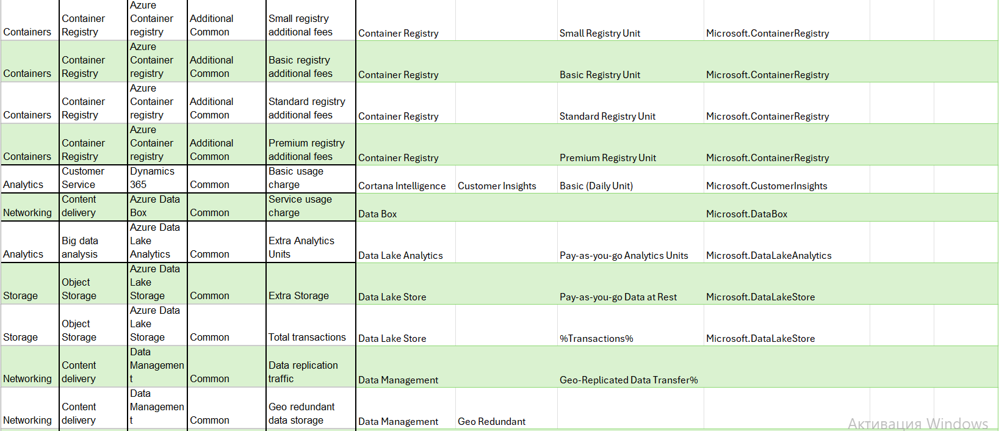
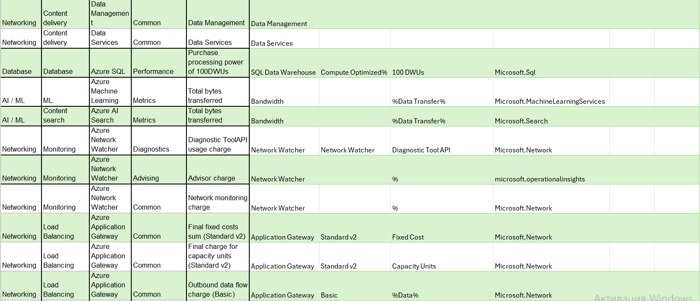

# Лабораторная работа 2 (Azure). 
## Вариант 9

## Цель работы
Получение навыков аналитики и понимания спектра публичных облачных сервисов без привязки к вендору. Формирование у студентов комплексного видения Облака. 

## Дано

Импортируем .csv, имеем данные биллинга от Azure.

## Сервисы

1. Ресурс **Microsoft.ContainerInstance** указывает на сервис **Azure Container Instances**, который позволяет запускать докер контейнеры в управляемом окружении Azure, данный сервис подходит для систем, которые работают в небольшом числе контейнеров.
2. Ресурс **Microsoft.ContainerRegistry** указывает на сервис **Azure Container Registry**, который позволяет хранить и управлять докер образами, позволяет build'ить образы в облаке Azure .
3. Ресурс **Microsoft.CustomerInsights** отвечает сервису от Майкрософт **Dynamics 365 Customer Service**, который помогает в выполнении анализа клиентов, их персонализации, налаживании связи для оптимизации бизнес процессов компании.
4. Ресурс **Microsoft.DataBox** указывает на сервис **Azure Data Box**, услуга, заключающаяся в оффлайн передаче информации от вашего хоста до ближайшего датацентра Azure (или наоборот) с помощью `Data Box` - по сути это несколько SSD дисков с суммарным объемом до 80 ТБ. Сервис позволяет переносить в облако огромные объемы информации без нагрузки на сеть и быстрее.
5. Ресурс **Microsoft.DataLakeAnalytics** соотв. сервису **Azure Data Lake Analytics**, сервис выполняет анализ Больших данных, размер который масштабируется без верхнего предела, оплата производится только во время выполнения аналитических вычислений.
6. Ресурс **Microsoft.DataLakeStore** - это **Azure Data Lake Storage**, который по сам по себе не является отдельным сервисом, а предоставляет дополнительные возможности (связанные с лучшей безопасностью, масштабируемостью и уклоном в анализ больших данных) для `Azure Blob Storage` - решение объектного хранилища от Azure.
7. Ресурс **Microsoft.sql** ссылается на **Azure SQL** - продукт включающий в себя 3 сервиса `Azure SQL Database` (PaaS сервис базы данных на основе движка Microsoft SQL),`Azure SQL Managed Instance` (почти то же, что и `Azure SQL Database`, но более гибкое решение для миграции в облако, в общем более совместимое решение с on-premises базами данных) и `SQL Server on Azure VM` (сервис выделяющий виртуалки под сервера баз данных).
8. Ресурс **Microsoft.MachineLearningServices** соответсвует сервису **Azure Machine Learning**, которые предоставляет возможности создания, тренировки и тестирования модели машинного обучения в облаке. 
9. Ресурс **Microsoft.Search** указывает на сервис **Azure AI Search** - поисковой сервис с использованием ИИ, индексирует текстовые файлы / документы для последующего интеллектуального поиска информации.  
10. Ресурс **Microsoft.Network** связан с группой продуктов Azure, ориентированных на Networking, это могут быть сервисы типа `Azure DNS`, `Azure DDoS Protection`, `Azure Firewall`, `Azure Load Balancer` и т.д. Вообщем сервисы для управления сетевой структурой облака. В контексте данного биллинга (9 вар) **Microsoft.Network** относиться к продуктам **Azure Application Gateway** и **Azure Network Watcher**.
11. Сервис **Azure Network Watcher** который отвечает за мониторинг и диагностику других IaaS решений от Azure, т.е. для виртуалок в облаке, виртуальных сетей, балансировщиков нагрузки и т.д. Не используется для PaaS решений.
12. Сервис **Azure Application Gateway** предоставляет балансировщик нагрузки для веб-приложений. По сути в зависимости от запроса к вашему веб-приложению определяет на какой именно сервер вашей инфраструктуры послать этот запрос. 
13. Ресурс **microsoft.operationalinsights** также связан с мониторингом облачной сети в сервисе **Azure Network**.

## Результат
С помощью официальной документации Azure и документации Bicep получаем

## Выводы
В результате выполнения лабораторной работы 2, для фрагмента биллинга облачным провайдером Azure была составлена классификация сервисов и их функций. Классификация является кросс-провайдерной, продолжающей классификацию в 1-й облачной лабе (AWS) и, где надо совпадает с ней.
