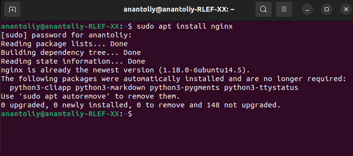
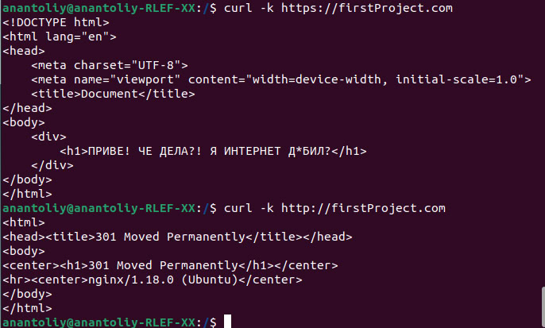
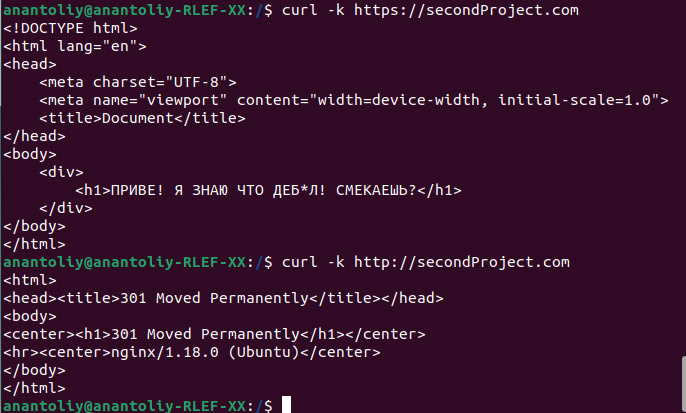
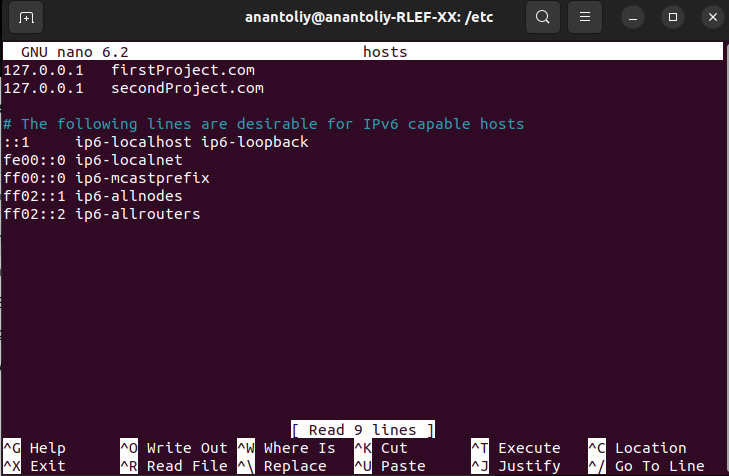
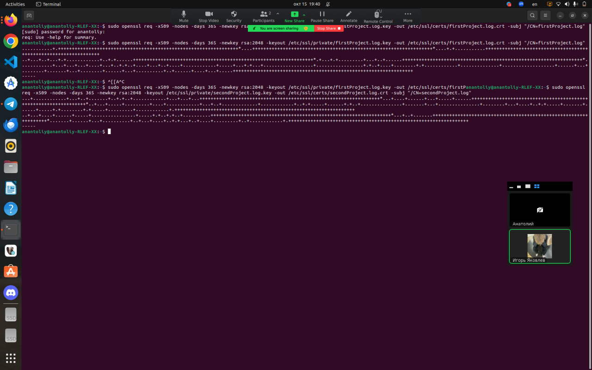
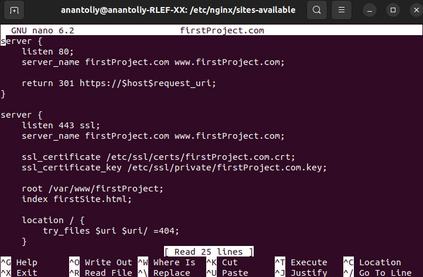
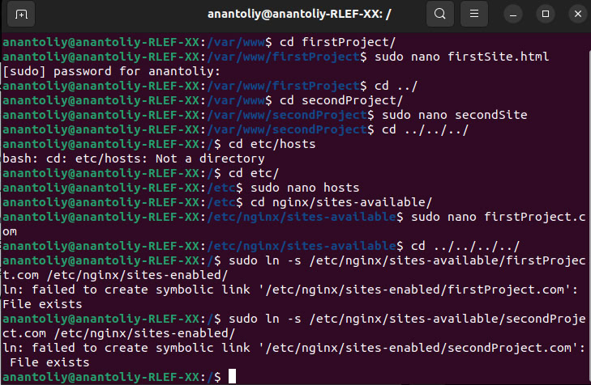

# cloudLab1# Первая лабораторная работа

## Задачи лабы

В ходе лабораторной работы необходимо, чтобы:

* Подключение осуществлялось через протокол https с сертификатом;
* Было настроено принудительное перенаправление HTTP-запросов (порт 80) на HTTPS (порт 443) для обеспечения безопасного соединения;
* Использовался alias для создания псевдонимов путей к файлам или каталогам на сервере;
* Имелись настроенные виртуальные хосты для обслуживания нескольких доменных имен на одном сервере.

### Начнем!

## Установка nginx

Для начала нужно установить nginx(Он уже установлен)




## Создание проектов
Для выполненя лабы создадим два простых html файла. Для них создадим две папки
```bash
sudo mkdir -p /var/www/firstProject
sudo mkdir -p /var/www/secondProject
```
Далее создадим файлы





Вау, теперь нужно прописать домены.

```bash
sudo nano /etc/hosts
```
И мы попадаем в встроенный редактор кода nano, в котором нужно установить нужные локальные домены. Установим `firstProject.com` и `secondProject.com`.

Чтобы сохранить, жмем `Ctrl + O`, затем нажать на `Enter` и выходим из nano, нажав `Ctrl + X`



Теперь домены у проектов есть, но файлы конфигурации не настроены. Надо исправлять.

## Настройка файлов конфигурации
Теперь подумаем о перенаправлении с порта 80 на порт 443(безопасное подключение).

### Создание самоподписанных ssl сертификатов
Теперь создадим самоподписные сертификаты, чтобы можно было работать по https



Сертификаты есть, переходим к настройке файлов конфигурации

### Собственно настройка файлов конфигурации

В файлах конфигурации у нас будет два блока `server{}`, где в одном у нас запросы буду слушаться на порту 80(http) и перенаправляться на https, а во втором блоке запросы будут уже слушаться на порту 443(https). В каждом блоке нужно имя сервера `server_name`, которое будет такое же, как и наши указанные локальные домены(так мы указываем, для какого домена серверу надо обрабатывать запросы). Во втором блоке будут указываться наши самоподписанные сертификаты  `ssl_sertificate` и ключи `ssl_sertificate_key`. Также обозначим корневую директорию сайта и установим `index.html` главной страницей. Для первого проекта выглядит файлик так, для второго создадим аналогичный.



На данном этапе файлы конфигурации готовы, теперь создадим символическую ссылку на файл конфигурации для сайта.



### Проверяем работу сайтиков
Теперь мы пропишим команду curl.


Ура все работает!!!
