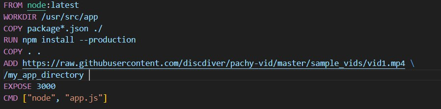
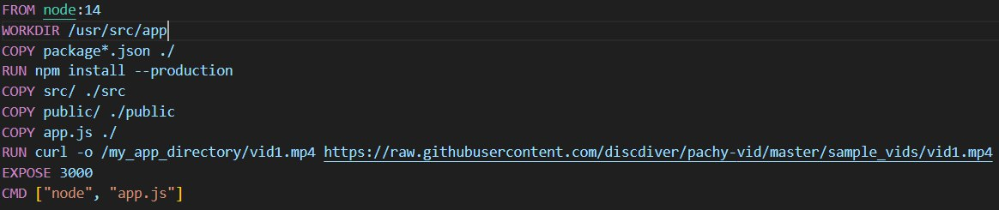

# Отчёт по лабораторной работе по DevOps №2
## Содержание:
- ["Bad" Dockerfile](#bad-dockerfile)
- ["Good" Dockerfile](#good-dockerfile)
- ["Bad Практиси" в контейнерах](#bad-Практиси-в-контейнерах)

## "Bad" Dockerfile

Что же такого **"bad"** в этом файле?

1. `FROM node:latest`
   
   Использовать тег latest для базовых образов крайне нежелательно, так как это создает неопределенное поведение по мере того, как базовый образ будет обновляться. К тому же это не гарантирует, что последние версии базовых образов не будут уязвимы.
   
2. `COPY . .`
   Команда из примера ниже может привести к тому, что файл секрета случайно окажется внутри вашего образа, если находится внутри той же директории. Если вы имеете подобные файлы, не забывайте использовать .dockerignore. Среди файлов внутри образа могут оказаться .git, .aws, .env.  

   
3. `ADD`
   
   Инструкция ADD, получив в качестве параметра путь к архиву, автоматически распакует этот архив при своем выполнении. Это может привести, в свою очередь, к появлению zip-бомбы внутри контейнера. При распаковке zip-бомба может вызвать отказ в обслуживании (DoS) приложения, путем заполнения всего выделенного свободного места.

## "Good" Dockerfile

Что стало "good"?

1. `FROM node:14`
   
   Мы изменили базовый образ на определенную версию, и теперь он не сможет обновиться самостоятельно.
   
2. `COPY package*.json ./`

   Здесь избавились от . . и указали конкретно что мы хотим положить внутрь нашего образа
   
3. `RUN curl`
   
   Использование ADD для загрузки файлов из URL не является хорошей практикой. Лучше использовать RUN curl чтобы явно контролировать процесс загрузки.

## "Bad Практиси" в контейнерах

1. Использование образов без проверки
   
   Загрузка и использование образов из ненадежных источников или публичных репозиториев без проверки их содержимого может привести к уязвимостям и проблемам с безопасностью. Злоумышленники могут внедрить вредоносный код в образы, что создаст риски для вашей инфраструктуры.

2. Неиспользование сетевых изоляций
   
    Запуск контейнеров в одной и той же сети без должной изоляции может привести к несанкционированному доступу и утечке данных. Например, если все контейнеры находятся в одной сети и имеют доступ друг к другу, это увеличивает вероятность атак и компрометации.

---
