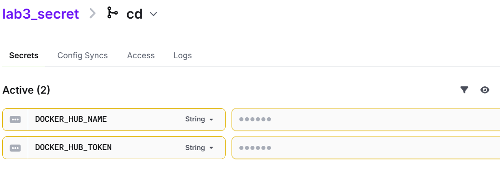
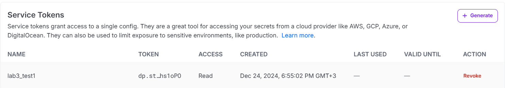
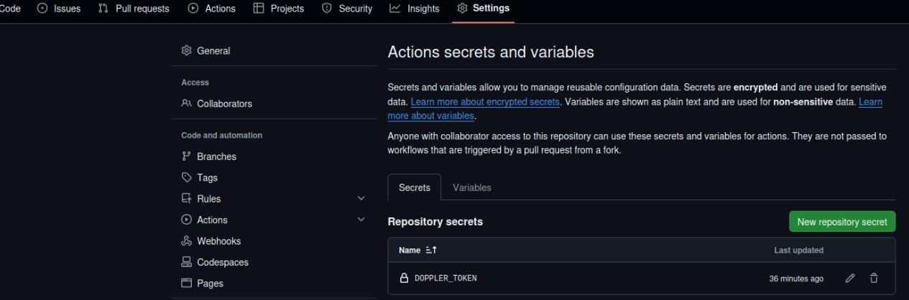
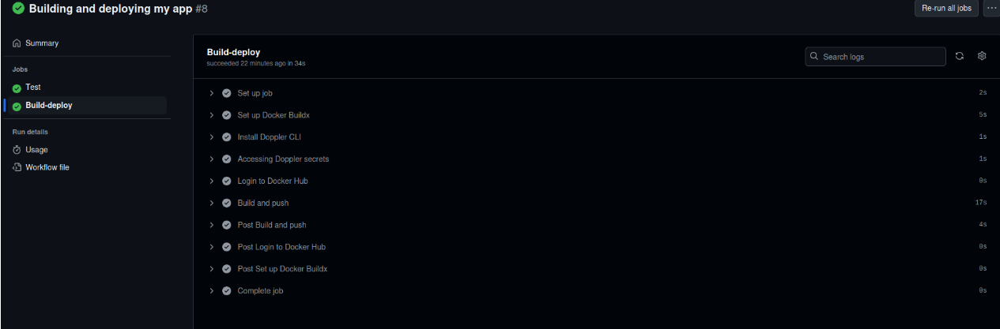
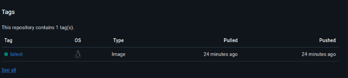

# Лабораторная 3 со звездочкой)

## Задание
Сделать красивенько работу с секретами. Например, поднять Hashicorp Vault (или другую секретохранилку) и сделать так, чтобы ci/cd пайплайн (или любой другой ваш сервис) ходил туда, брал секрет, использовал его не светя в логах. 
В Readme аргументировать почему ваш способ красивый, а также описать, почему хранение секретов в CI/CD переменных репозитория не является хорошей практикой.

## Выбор ПО

Я выбрал `Doppler`, потому что (~~мне посоветовали друзья~~) он прост в освоении, тока зарегаться через впн и усе.

## Ход работы

Сначала создадим аккаунт, создадим в нем проект, добавим в конфиг 2 секрета `DOCKER_HUB_NAME` и `DOCKER_HUB_TOKEN`.



Теперь, чтобы получить доступ в этим секретам нам нужен `service token` допплера, который даст нам доступ к конфигу `cd`, генерируем:



Создаем секрет с этим токеном в репозитории



Теперь надо изменить yaml файл пайплайна. Мы решили провернуть это на новом ci/cd, тут у нас код проходит через раннеры и потом создается образ контейнера, который загружается в докер хаб.

```
  Build-deploy:
    needs: Test
    runs-on: ubuntu-22.04
    steps:
      - name: Set up Docker Buildx
        uses: docker/setup-buildx-action@v3
      - name: Install Doppler CLI
        uses: dopplerhq/cli-action@v3
      - name: Accessing Doppler secrets
        run: |
          echo ${{ secrets.DOPPLER_TOKEN }} | doppler configure set token --scope /
          echo "DOCKER_HUB_NAME=$(doppler secrets get DOCKER_HUB_NAME --plain)" >> $GITHUB_ENV
          echo "DOCKER_HUB_TOKEN=$(doppler secrets get DOCKER_HUB_TOKEN --plain)" >> $GITHUB_ENV
      - name: Login to Docker Hub
        uses: docker/login-action@v3
        with:
          username: ${{ env.DOCKER_HUB_NAME }}
          password: ${{ env.DOCKER_HUB_TOKEN }}
      - name: Build and push
        uses: docker/build-push-action@v6
        with:
          push: true
          tags: ${{ env.DOCKER_HUB_NAME }}/my_app:latest
```

Здесь мы с помощью action ставим допплер на раннер, логинимся через токен допплера и секреты из допплера переносим в переменные окружения раннера, используем их чтобы запушить образ со скриптом.



Как видим, пайплайн успешно отработал и образ успешно запушился



## Аргументы?

1. **Безопасность:**
   - Секреты не хранятся в коде или в переменных репозитория.
   - Vault и любая другая сикрит хранилка обеспечивает шифрование секретов и детализированное управление доступом .
   - Секреты автоматически маскируются в логах, предотвращая утечку данных.

2. **Динамические секреты:**
   - Vault позволяет генерировать временные токены для доступа к ресурсам, минимизируя риск компрометации.

3. **Управляемость:**
   - Централизованное управление секретами упрощает их ротацию и аудит.

4. **Логирование доступа:**
   - Vault ведёт журнал всех операций, что повышает прозрачность и обеспечивает возможность расследования инцидентов.

## Почему хранение секретов в CI/CD переменных репозитория — плохая практика?

1. **Повышенный риск утечек:**
   - Любой, кто имеет доступ к репозиторию, потенциально может просмотреть секреты.

2. **Отсутствие ротации:**
   - Сложно и неудобно обновлять секреты, что часто приводит к использованию устаревших токенов.

3. **Ограниченная безопасность:**
   - GitHub Secrets защищены, но их использование в логах или коде может случайно раскрыть их.

## Итог

В результате выполнения лабы 3 со звездочкой, пайплайн был настроен так чтобы принимать секреты из Doppler.
