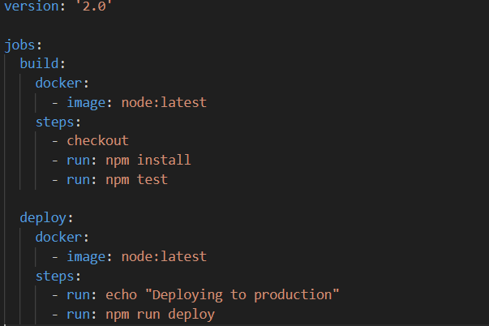

# Отчёт по лабораторной работе по DevOps №3
## Содержание:
- ["Bad" practies](#bad-practies-(плохиши-фуу))
- ["Good" practies](#good-practies-(нормальные-мужики-внатуре))

## "Bad" practies(плохиши фуу)

Что же такого **"bad"** в этом файле?

1. `image: node:latest`
   
  Образ node:latest может изменяться, что приведет к непредсказуемым результатам сборки. 
   
2. `Отсутствие проверки на уязвимости`
   Не проверяются зависимости на наличие уязвимостей, что может привести к проблемам безопасности. 

   
3. `Отсутствие обработки ошибок  `
   
   Если любой шаг завершится с ошибкой, это не будет обработано, и процесс продолжится.  

4. ` Отсутствие версионирования артефактов `

    Нет указания на версионирование при деплое, что может привести к путанице с версиями.    

5. `Отсутствие тестирования в разных окружениях `

    Тестирование происходит только в одном окружении, что не гарантирует стабильность в других средах.  

## "Good" practies(нормальные мужики внатуре)

Что стало **"good"**?

1. ` Использование конкретной версии образа `
   
   Заменен node:latest на node:14.  
   Влияние: Обеспечивает стабильность сборок и предотвращает неожиданные изменения в поведении приложения.
   
2. `Добавление проверки на уязвимости `

   Исправление: Добавлен шаг npm audit.  
   Влияние: Позволяет выявлять и устранять уязвимости в зависимостях до деплоя.
   
3. `Обработка ошибок`
   
   Исправление: Включение set -e.  
   Добавление set -e: Теперь перед выполнением команд npm install, npm audit, npm test и npm run deploy используется set -e. Это гарантирует, что если любая из команд завершится с ошибкой, весь процесс остановится, и последующие шаги не будут выполнены.

4. `Версионирование артефактов `

    Исправление: Добавлен шаг для создания версии перед деплоем.  
    Влияние: Упрощает управление версиями и позволяет легко откатиться к предыдущей версии, если потребуется.

5. `Тестирование в разных окружениях`

    Исправление: Добавлены этапы для тестирования в staging.  
    Влияние: Улучшает уверенность в том, что код будет работать в продакшене, так как он протестирован в условиях, приближенных к реальным.

---